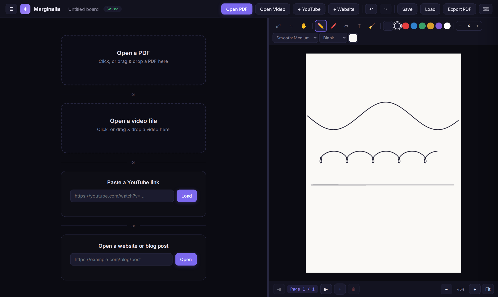

# ✦ Marginalia

Read on one side, write on the other. Marginalia opens a **PDF, a video file, a YouTube video or a web article**
next to a **pressure-sensitive notebook**, so you can take handwritten notes without juggling two windows.



## Download

**Windows 10 / 11 (64-bit):** get `Marginalia-Setup-1.2.1.exe` from the
[latest release](../../releases/latest). No administrator rights are needed.
See [the install guide](docs/INSTALL.md) for the Windows SmartScreen step and first-launch notes.

Prefer the browser? Download [`Marginalia.html`](Marginalia.html) and open it. For YouTube and the
Reader view for websites, run it from a local server: on Windows double-click
[`Start Marginalia.bat`](Start%20Marginalia.bat) (needs Python), or run `python marginalia_server.py 8000`
and open `http://localhost:8000/Marginalia.html`.

## Features

- **Ink pen** modelled on [Rnote](https://github.com/flxzt/rnote)'s pen: a spring-mass stroke model
  (Google's ink-stroke-modeler) with prediction to the pen tip, linear pressure-to-width and round-capped
  segments. The line stays exactly where you wrote it (Smooth: Off / Low / Medium / High).
  The older calligraphic **Brush** pen ([perfect-freehand](https://github.com/steveruizok/perfect-freehand))
  is still available.
- **Sources side by side:** PDFs (PDF.js), local video, YouTube, and websites in a clean Reader view
  (Mozilla Readability) or Live view.
- **Tools:** pen, highlighter, eraser, lasso select, drag, shapes (lines, arrows, rectangles, circles,
  triangles, polygons, stars), text, undo/redo and keyboard shortcuts.
- **Boards:** every canvas is a board, auto-saved on your computer (IndexedDB). Export or import all
  boards as one backup file.
- **Export PDF** of your notes.
- Nothing is uploaded: your boards stay on your machine.

## Repository layout

| Path | What it is |
|---|---|
| `Marginalia.html` | The whole app in one file. This is the source of truth. |
| `marginalia_server.py`, `Start Marginalia.bat` | Small local server for the browser version |
| `desktop/` | Electron wrapper that packages the app for Windows (see [desktop/README.md](desktop/README.md)) |
| `docs/` | Install guide and screenshots |

## Building the Windows app

```bash
cd desktop
npm install
npm run dist          # builds app/ from ../Marginalia.html, then the installer
```

## Licence

Marginalia is released under the [MIT licence](LICENSE). It bundles open-source libraries and fonts
under their own licences; see [desktop/THIRD_PARTY_LICENSES.txt](desktop/THIRD_PARTY_LICENSES.txt).
